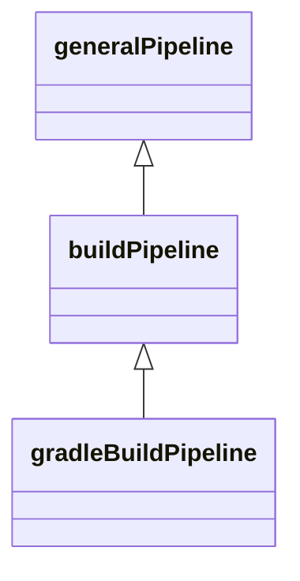
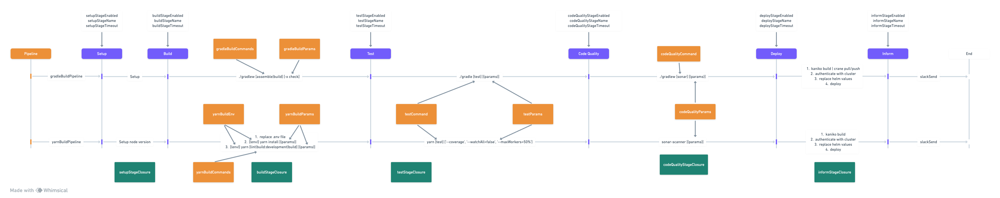

# Infra jenkins

This repo contains the shared jenkins library code and will also release a custom jenkins build agent for Spartan
project

## Custom build agent

The docker file is located at `agents/base/Dockerfile`. It is designed to build *jvm-based* code, in the future we
will provide another custom agent together with the pipeline to support more type of applications

## Jenkins shared lib

The purpose of this shared lib is to centralize and standardize the build and deploy flow of all applications. By
wrapping all the necessary logic inside and react based on the configurations given by the application pipeline.

There are 3 types of pipeline supported, the later will have all the configurations of pipeline above



### General Pipeline

#### Example

```groovy
@Library('spartan') _

generalPipeline {
    nodeBuildLabel = 'builder'

    buildEnabled = true
    devDeploymentEnabled = false
    prodDeploymentEnabled = false

    setupStageEnabled = false
    buildStageClosure = { ctx, jobEnv ->
        ctx.echo 'Hello'
    }
}
```

This creates a Jenkins pipeline with the following features:

* build will allocate a node inherited from _builder_ Jenkins agent
* do a checkout at the current revision
* execute a stage with name "Build" that prints "Hello" to the log

#### Parameters

| Name                      | Default Values | Descriptions                                                                  |
|---------------------------|----------------|-------------------------------------------------------------------------------|
| jobEnvClosure             | JenkinsJobEnv  | Env Class for this build                                                      |
| extraLibProperties        | [:]            | Provide extra properties or override the current one in jenkins libray        |
| buildEnabled              | false          | Enable build step                                                             |
| devDeploymentEnabled      | false          | Enable deployment to dev env                                                  |
| prodDeploymentEnabled     | false          | Enable deployment to production env                                           |
| nodeBuildLabel            | null           | Agent type to inherit, either `builder` or `lightweight`                      |
| setupStageName            | Setup          | Setup stage name                                                              |
| setupStageEnabled         | true           | Enable setup stage                                                            |
| setupStageTimeout         | 10             | Setup stage timeout, unit is `MINUTES`                                        |
| setupStageClosure         | null           | Custom setup stage logic, default it only set the build number to build title |
| buildStageClosure         | null           | Custom build stage logic, there is no default logic, must be overrided        |
| deployStageClosure        | null           | Custom deploy stage logic, there is no default logic, must be overrided       |             
| informStageName           | Inform         | Inform result stage name                                                      |
| informStageEnabled        | true           | Enable inform stage                                                           |
| informStageTimeout        | 5              | Inform stage timeout, unit is `MINUTES`                                       |
| informStageClosure        | null           | Custom inform stage logic, default it doing nothing                           |
| cloudName                 | null           | Specify the cloud provider for the cloud interactions                         |
| cloudRegion               | null           | Specify the cloud region for cloud interactions                               |
| additionalContainerConfig | [kaniko: [:]]  | Specify additional containers with the override env for pod template          |

### Build pipeline

#### Example

The build pipeline is _abstract_, so it cannot be executed directly. All examples here apply to all derived pipelines.

##### Build Pipeline with Only a Build and no Deploy Stage

```groovy
@Library('spartan') _

buildPipeline {
    buildEnabled = true
    devDeploymentEnabled = false
    prodDeploymentEnabled = false
}
```

#### Parameters

The build pipeline is an extension of the `generalPipeline`. All parameters available in that pipeline
type are also available in this one. Here is the extra ones:

| Name                     | Default Value                                                                                             | Description                                                                           |
|--------------------------|-----------------------------------------------------------------------------------------------------------|---------------------------------------------------------------------------------------|
| serviceConfigurations    | null                                                                                                      | A map of configrations use to deploy the application, must be override                |
| testStageEnabled         | env.isPullRequestBuild()                                                                                  | Enable test stage, default only enable on PR build                                    |
| testStageTimeout         | 30                                                                                                        | Test stage timeout, unit is `MINUTES`                                                 |
| codeQualityStageEnabled  | false                                                                                                     | Enable code quality stage                                                             |
| codeQualityStageTimeout  | 20                                                                                                        | Code quality timeout, unit is `MINUTES`                                               |
| helmValuesPath           | `k8s/dev/values.yaml` if build release branch, `k8s/prod/values.yaml` if build tag, otherwise throw error | Helm values file path                                                                 |
| helmStageName            | Deploy Helm                                                                                               | Helm deploy stage name                                                                |
| helmStageEnabled         | true if `devDeploymentEnabled` or `prodDeploymentEnabled` is true, otherwise false                        | Enable helm deploy stage                                                              |
| helmStageTimeout         | 15                                                                                                        | Helm deploy timeout, unit is `MINUTES`                                                |
| helmAdditionalDeployVars | []                                                                                                        | Additional envs needed to replaced into values file that need a custom logic to build |
| helmAdditionalFilePaths  | ['']                                                                                                      | Additonal helm values file                                                            |

### Flow diagram



### Gradle build pipeline

#### Example

##### Gradle Build Pipeline execute `assemble` when build, `check` at test and run `sonar` when do code quality check

```groovy
@Library('spartan') _

gradleBuildPipeline {
    gradleBuildCommands = ['assemble']
    testCommand = 'check'
    codeQualityCommand = 'sonar'
}
```

#### Parameters

The build pipeline is an extension of the `buildPipeline`. All parameters available in that pipeline
type are also available in this one. Here is the extra ones:

| Name                 | Default Value | Description                                         |
|----------------------|---------------|-----------------------------------------------------|
| gradleStageEnabled   | true          | Enable gradle stage                                 |
| gradleStageTimeout   | 15            | Gradle build timeout, unit is `MINUTES`             |
| gradleStageName      | Build         | Gradle build stage name                             |
| gradleBuildCommands  | ['build']     | List of gradle build tasks to be executed           |
| gradleBuildParams    | null          | List of gradle parameters, apply to all build tasks |
| testStageName        | Test          | Test stage name                                     |
| testCommand          | test          | Gradle test task                                    |
| testParams           | []            | Gradle test parameters, apply to gradle test task   |
| codeQualityStageName | Code Quality  | Code Quality stage name                             |
| codeQualityCommand   | sonar         | Code Quality gradle task name                       |
| codeQualityParams    | []            | Code Quality parameters, apply to code quality task |

### Important parameters

#### serviceConfigurations

This parameter isn't a freestyle map, the key must be follow the list below:

| Name               | Description                                                                                                                                                                          |
|--------------------|--------------------------------------------------------------------------------------------------------------------------------------------------------------------------------------|
| name               | Name of the service, will be use to load the credentials to deploy                                                                                                                   |
| dockerRepoBaseName | The basename of the docker repo, will be appened with the environment name when pushing the docker image                                                                             |
| deploymentName     | Name of the deployment for this service, will be use to named the deployment on the cluster                                                                                          |
| helmRepo           | Name of the helm repo to fetch the helm chart                                                                                                                                        |
| chartPath          | Path the of the helm chart will be use to deploy                                                                                                                                     |
| chartVersion       | Helm chart version will be use                                                                                                                                                       |
| credentialsToEnvs  | A map of variables to credentials key on jenkins, the jenkins lib will automatically prepend the service name and appended with the environment to construct the full credential key |
| clusterNamePrefix  | The cluster name prefix for getting cluster's config                                                                                                                                 |
